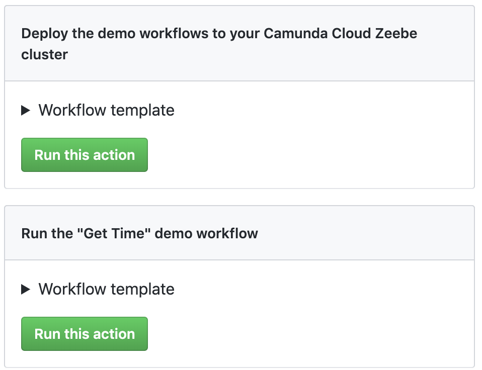
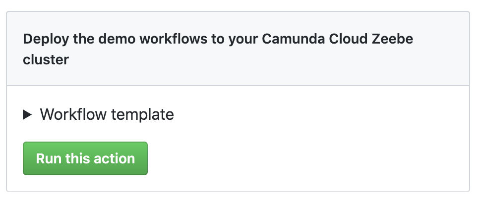
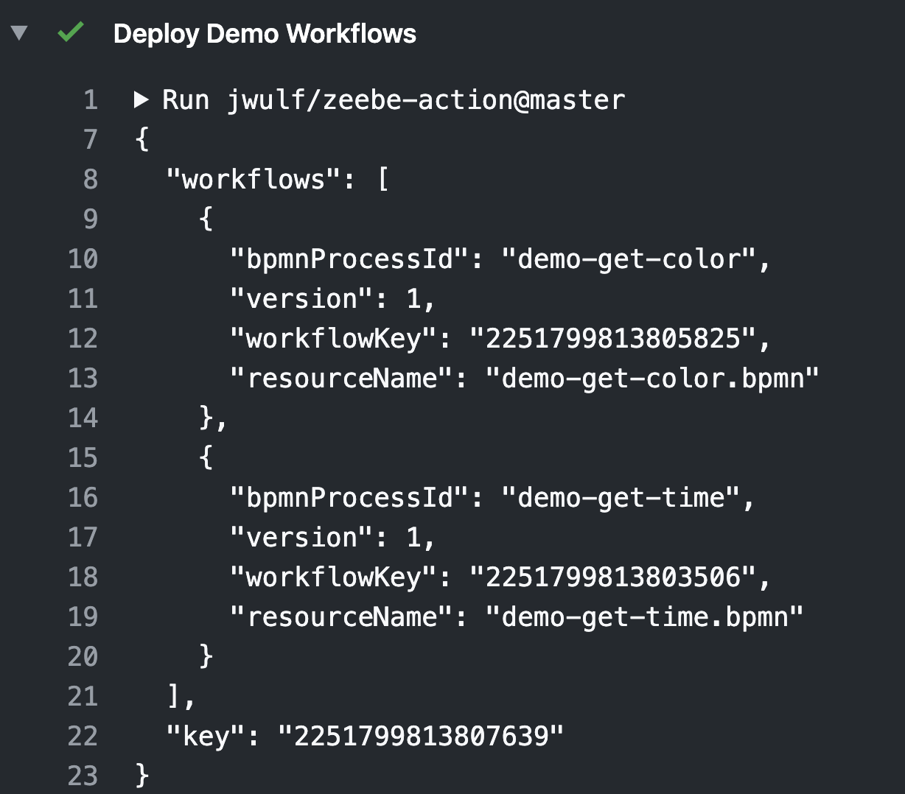

# Camunda Cloud Starter

Getting Started with Camunda Cloud with no code or installation of software, using the [Zeebe GitHub Action](https://github.com/marketplace/actions/zeebe-action).

## Setup

* Fork this repo to your own account.
* Get a [Camunda Cloud](https://camunda.io) Account.
* Create a new client in the Camunda Cloud console.
* Click the button to copy the entire client configuration

* Create a new secret in your forked repository's Settings > Secrets ([instructions](https://help.github.com/en/actions/configuring-and-managing-workflows/creating-and-storing-encrypted-secrets#creating-encrypted-secrets)). Call it `ZEEBE_CLIENT_CONFIG`, and paste in the client config:

When you hit "Add secret", you should see this:

* Now, we will add an app to this repo that lets you trigger GitHub Actions from a web-based UI. Go to [Actions Panel](https://www.actionspanel.app/) and sign in with your GitHub account.

* Install the Actions Panel app to your forked repo.

* Go back to [Actions Panel](https://www.actionspanel.app/)

* You now have buttons to run the various demo workflows in this starter.

## Deploy the demo workflows

* Open the "Actions" view in your repo in one browser tab.

* Open [Actions Panel](https://www.actionspanel.app/) in another browser window.

* In Actions Panel, click on "Run this action" for "_Deploy the demo workflows to your Camunda Cloud Zeebe cluster_". This will deploy the workflows to your cluster.

* After you click the button, refresh the Actions view in the other browser window. You will see the "Deploy Workflows" job running.

* Click in the details of the job, and you will see the workflows being deployed to the cluster.

* The workflow definitions are now deployed to the cluster. Go to the Camunda Operate dashboard in Camunda Cloud and you will see them there.

The GitHub Action that deploys the workflows to Camunda Cloud is in [.github/workflows/deploy-workflows.yml](/.github/workflows/deploy-workflows.yml).

Under the hood, the Zeebe GitHub Action uses the [Zeebe Node.js client](https://www.npmjs.com/package/zeebe-node#deploy-a-workflow) to do this (see the code [here](https://github.com/jwulf/zeebe-action/blob/master/src/main.ts#L88)). 

## Run the Get Time demo

The Get Time demo model is [bpmn/demo-get-time.bpmn](bpmn/demo-get-time.bpmn).

If you open the model in the [Zeebe Modeler](https://github.com/zeebe-io/zeebe-modeler), you will see this:

It has a single task in it. The task is serviced by the Camunda Cloud HTTP Worker. It does a GET request to [http://time.jsontest.com/](http://time.jsontest.com/) to get the current time as a JSON object.

Let's create an instance of this workflow.

* In your [Actions Panel](https://www.actionspanel.app/), click on "Run this action" for "_Run the "Get Time" demo workflow_".

* In the Actions view of your repo, you will see the "Run Get Time Demo" running. The code for this is in [.github/workflows/demo-get-time.yml].

