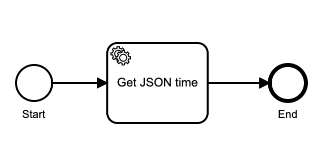

# Camunda Cloud Starter

Getting Started with Camunda Cloud using GitHub.

## Setup

* Fork this repo to your own account.
* Get a [Camunda Cloud](https://camunda.io) Account.
* Create a new client in the Camunda Cloud console.
* Click the button to copy the entire client configuration

* Create a new secret in your repository's Settings > Secrets ([instructions](https://help.github.com/en/actions/configuring-and-managing-workflows/creating-and-storing-encrypted-secrets#creating-encrypted-secrets)). Call it `ZEEBE_CLIENT_CONFIG`, and paste in the client config:

* Go to [https://www.actionspanel.app/](https://www.actionspanel.app/) and sign in with GitHub.

* Install the Actions Panel app to your forked repo.

* Go back to [https://www.actionspanel.app/](https://www.actionspanel.app/)

* You now have buttons to run the various demo workflows in this starter.

## Deploy the demo workflow

* Open the "Actions" view in your repo in one browser tab.

* Open [https://www.actionspanel.app/](https://www.actionspanel.app/) in another browser window.

* In the Action panel, click on "Run this action" for "_Deploy the demo workflows to your Camunda Cloud Zeebe cluster_". This will deploy the workflows to your cluster.

* After you click the button, refresh the Actions view in the other browser window. You will see the "Deploy Workflows" job running.

* Click in the details of the job, and you will see the workflows being deployed to the cluster.

* The workflow definitions are now deployed to the cluster. Go to the Camunda Operate dashboard in Camunda Cloud and you will see them there.

## Run the Get Time demo

The Get Time demo model is [bpmn/demo-get-time.bpmn](bpmn/demo-get-time.bpmn).

If you open the model in the [Zeebe Modeler](https://github.com/zeebe-io/zeebe-modeler), you will see this:

It has a single task in it. The task is serviced by the Camunda Cloud HTTP Worker. It does a GET request to [http://time.jsontest.com/](http://time.jsontest.com/) to get the current time as a JSON object.

Let's create an instance of this workflow.

* In your [Action Panel](https://www.actionspanel.app/)), click on "Run this action" for "_Run the "Get Time" demo workflow_".

* In the Actions view of your repo, you will see the "Run Get Time Demo" running. The code for this is in [.github/workflows/demo-get-time.yml].

