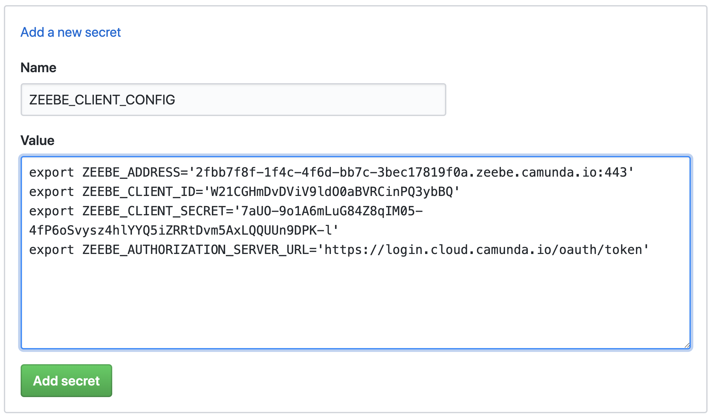

# Camunda Cloud Starter

Getting Started with Camunda Cloud using GitHub.

## Setup

* Fork this repo to your own account.
* Get a [Camunda Cloud](https://camunda.io) Account.
* Create a new client in the Camunda Cloud console.
* Click the button to copy the entire client configuration

* Create a new secret in your repository's Settings > Secrets ([instructions](https://help.github.com/en/actions/configuring-and-managing-workflows/creating-and-storing-encrypted-secrets#creating-encrypted-secrets)). Call it `ZEEBE_CLIENT_CONFIG`, and paste in the client config:

* Go to [https://www.actionspanel.app/](https://www.actionspanel.app/) and sign in with GitHub.

* Install the Actions Panel app to your forked repo.

* Go back to [https://www.actionspanel.app/](https://www.actionspanel.app/)

* You now have buttons to run the various demo workflows in this starter.

## Run the demos

* Open the "Actions" view in your repo in one browser tab.

* Open [https://www.actionspanel.app/](https://www.actionspanel.app/) in another.

* Click on "Run this action" to "Deploy the demo workflows to your Camunda Cloud Zeebe cluster".

* After you click it, refresh the Actions view in the repo.